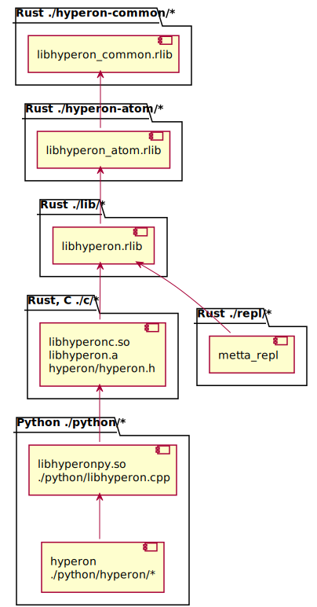

# Overview

OpenCog Hyperon is a substantially revised, novel version of OpenCog - which is currently at an active
pre-alpha stage of development and experimentation. One of the focuses in the Hyperon design is a successor
to the OpenCog Classic Atomese language with clear semantics supporting meta-language features,
different types of inference, etc. What we have landed on is an "Atomese 2" language called MeTTa (Meta Type Talk).

In order to get familiar with MeTTa one can read [MeTTa specification](https://wiki.opencog.org/w/File:MeTTa_Specification.pdf)
and watch video with different [MeTTa example explained](https://singularitynet.zoom.us/rec/share/VqHmU37XtbS7VnKY474tkTvvTglsgOIfsI-21MXWxVm_in7U3tGPcfjjiE0P_15R.yUwPdCzEONSUx1EL?startTime=1650636238000).
The examples of MeTTa programs can be found in [./python/tests/scripts](./python/tests/scripts) directory.
Please look at the [Python unit tests](./python/tests) to understand how one can use MeTTa from Python.
More complex usage scenarios are located at [MeTTa examples repo](https://github.com/trueagi-io/metta-examples).
A lot of different materials can be found on [OpenCog wiki server](https://wiki.opencog.org/w/Hyperon).

If you want to contribute the project please see the [contribution guide](./CONTRIBUTING.md) first.
If you find troubles with the installation, see the [Troubleshooting](#troubleshooting) section below.

# Prepare environment

## Docker

A docker image can be used as a ready to run environment.

Build docker image running:
```
docker build -t trueagi/hyperon https://raw.githubusercontent.com/trueagi-io/hyperon-experimental/main/Dockerfile
```

Run the image:
```
docker run --rm -ti trueagi/hyperon
```

Resulting container contains the latest code from the repo compiled and ready
to run.  If the docker image doesn't work, please raise an
[issue](https://github.com/trueagi-io/hyperon-experimental/issues).

## Manual installation

### Prerequisites

* Install latest stable Rust (1.63 or later), see [Rust installation
page](https://www.rust-lang.org/tools/install). Make sure your
`PATH` variable includes `$HOME/.cargo/bin` directory after installing
Rust (see the Notes at the installation page).

  Requirements for building C and Python API
  * Python3 and Python3-dev (3.7 or later)
  * Pip (23.1.2 or later)
  * GCC (7.5 or later)
  * CMake (3.15 or later)

* Install cbindgen:
```
cargo install --force cbindgen
```

* Install Conan and make default Conan profile:
```
python3 -m pip install conan==1.60.2
conan profile new --detect default
```

* Upgrade Pip to the required version:
```
python3 -m pip install pip==23.1.2
```

# Build and run

## Hyperon library

Build and test the library:
```
cd ./lib
cargo build
cargo test
```

Run examples:
```
cargo run --example sorted_list
```

To enable logging during running tests or examples export `RUST_LOG`
environment variable:
```
RUST_LOG=hyperon=debug cargo test
```

Running benchmarks requires nightly toolchain so they can be run using:
```
cargo +nightly bench
```

Generate docs:
```
cd ./lib
cargo doc --no-deps
```
Docs can be found at `./lib/target/doc/hyperon/index.html`.

## C and Python API

Setup build:
```
mkdir -p build
cd build
cmake ..
```
To run release build use `-DCMAKE_BUILD_TYPE=Release` cmake flag.

Build and run tests:
```
make
make check
```

## Running Python and MeTTa examples

In order to run examples you need to install the Python module. Please ensure
you built [C and Python API](#c-and-python-api) first. Then execute the
following command in the top directory of repository:
```
python3 -m pip install -e ./python[dev]
```

After this one can run unit tests within `python` directory using `pytest`:
```
pytest ./tests
```

One can run MeTTa script from command line:
```
metta ./tests/scripts/<name>.metta
```

### Logger

You can enable logging by prefixing the `metta` command line by

```
RUST_LOG=hyperon[::COMPONENT]*=LEVEL
```

where
- `[::COMPONENT]*` is a, possibly empty, sequence of modules and
  submodules of hyperon, such as `::metta`, `::metta::runner`,
  `::common`, `::common::multitrie`, etc.
- `LEVEL` is the log level.  Possible log levels are: `error`, `warn`,
  `info`, `debug` and `trace`.

For example, to log all hyperon messages at the `debug` level and
below, while running `script.metta`, you may type:

```
RUST_LOG=hyperon=debug metta script.metta
```

Or, to log all hyperon messages at the `trace` level and below,
restricted to module `metta` and submodule `types`, you may type:

```
RUST_LOG=hyperon::metta::types=trace metta script.metta
```

By default all log messages are directed to stderr.

## Troubleshooting

### Conan claims it cannot find out the version of the C compiler

If you see the following `cmake` output:
```
ERROR: Not able to automatically detect '/usr/bin/cc' version
ERROR: Unable to find a working compiler
WARN: Remotes registry file missing, creating default one in /root/.conan/remotes.json
ERROR: libcheck/0.15.2: 'settings.compiler' value not defined
```
Try to create the default Conan profile manually:
```
conan profile new --detect default
```
If it doesn't help, then try to manually add `compiler`, `compiler.version` and
`compiler.libcxx` values in the default Conan profile
(`~/.conan/profiles/default`).
For example:
```
conan profile update settings.compiler=gcc default
conan profile update settings.compiler.version=7 default
conan profile update settings.compiler.libcxx=libstdc++ default
```

### Rust compiler shows errors

Please ensure you are using the latest stable version:
```
rustup update stable
```

### Importing hyperon Python module fails

If importing the hyperon module in Python
```python
import hyperon
```

returns the error:
```
ModuleNotFoundError: No module named 'hyperonpy'
```

Please ensure you have installed the Python module, see
[Running Python and MeTTa examples](#running-python-and-metta-examples).

# Development

## Structure of the codebase

Main library `libhyperon.rlib` is written in Rust language, it contains core
API which can be used from other Rust projects. Source code of the library is
located under [./lib](./lib) directory. It is a plain Rust project which can be
built and tested using Cargo tool.

In order to provide API for platforms and languages other than Rust there is a
C API export library `libhyperonc`. Source code of the library is located under
[./c](./c) directory. The library contains Rust C API bindings and depends on
`libhyperon.rlib` library. Native library is compiled using Cargo, C headers
are generated using cbindgen tool.

Source code of the Python integration library is located under
[./python](./python) directory. It contains two main parts. First part is a
native Python library `libhyperonpy` which is written using
[pybind11](https://github.com/pybind/pybind11), it converts Python API calls
into C API calls and vice versa. Second part is a Python library `hyperon`
which uses `libhyperonpy` as a proxy for a C API calls.

All components which depend on `libhyperonc` are built using
[CMake](https://cmake.org/) build tool in order to manage dependencies
automatically.

The diagram below demonstrates main components and dependencies between them:

[Source code of the diagram](./docs/assets/structure.plantuml)

## Language support for IDEs

Different IDEs may require different tweaks to support the languages
used in the codebase. The language servers which we use
for development are:
- [Rust Language Server](https://github.com/rust-lang/rls#setup);
- [clangd](https://clangd.llvm.org/installation), generate compile
  commands for the `clangd` using `cmake` variable:
  ```
  cmake -DCMAKE_EXPORT_COMPILE_COMMANDS=Y ..
  ```
- [Python LSP server](https://github.com/python-lsp/python-lsp-server#installation).

