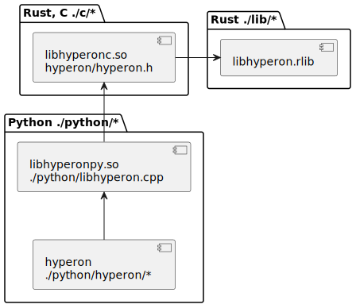

# Overview

This is a reimplementation from scratch of the C++ Hyperon prototype in the Rust
programming language. This project replaces the [previous
prototype](https://github.com/trueagi-io/hyperon/tree/master).
See [MeTTa scripts](./python/tests/scripts) and [Python examples](./python/tests) to become familiar with Hyperon features.

If you find troubles with the installation, see the [Troubleshooting](#troubleshooting) section below.

# Prepare environment

## Manual installation

Install latest stable Rust (1.63 or later), see [Rust installation
page](https://www.rust-lang.org/tools/install). Python 3 (3.6 or later), GCC
(7.5 or later) and CMake (3.10 or later) are required to build C and Python
API.

Install cbindgen:
```
cargo install --force cbindgen
```

Install Conan and make default Conan profile:
```
python3 -m pip install conan==1.47
conan profile new --detect default
```

Install Python library and dependencies in development mode (execute following
command in the top directory of repository):
```
python3 -m pip install -e ./python[dev]
```

## Docker

A docker image can be used to run a reproducible environment. See instructions
inside the [Dockerfile](./Dockerfile). If the docker image doesn't
work, please raise an
[issue](https://github.com/trueagi-io/hyperon-experimental/issues).

# Build and run

## Hyperon library

Build and test the library:
```
cd ./lib
cargo build
cargo test
```

To enable logging during tests execute:
```
RUST_LOG=hyperon=debug cargo test
```

Generate docs:
```
cd ./lib
cargo doc --no-deps
```
Docs can be found at `./lib/target/doc/hyperon/index.html`.

## C and Python API

Setup build:
```
mkdir -p build
cd build
cmake ..
```
To run release build use `-DCMAKE_BUILD_TYPE=Release` cmake flag.

Build and run tests:
```
make
make check
```

## Running Python and MeTTa examples from command line

In order to run examples you need to add Python libraries into the `PYTHONPATH`
after compilation:
```
cd build
export PYTHONPATH=$PYTHONPATH:`pwd`/python
```

Run MeTTa script from command line:
```
cd python/tests
python3 metta.py ./scripts/<name>.metta
```

## Troubleshooting

### Conan claims it cannot find out the version of the C compiler

If you see the following `cmake` output:
```
ERROR: Not able to automatically detect '/usr/bin/cc' version
ERROR: Unable to find a working compiler
WARN: Remotes registry file missing, creating default one in /root/.conan/remotes.json
ERROR: libcheck/0.15.2: 'settings.compiler' value not defined
```
Try to create the default Conan profile manually:
```
conan profile new --detect default
```
If it doesn't help, then try to manually add `compiler`, `compiler.version` and
`compiler.libcxx` values in the default Conan profile
(`~/.conan/profiles/default`).
For example:
```
conan profile update settings.compiler=gcc default
conan profile update settings.compiler.version=7 default
conan profile update settings.compiler.libcxx=libstdc++ default
```

### Rust compiler shows errors

Please ensure you are using the latest stable version:
```
rustup update stable
```

# Development

## Structure of the codebase

Main library `libhyperon.rlib` is written in Rust language, it contains core
API which can be used from other Rust projects. Source code of the library is
located under [./lib](./lib) directory. It is a plain Rust project which can be
built and tested using Cargo tool.

In order to provide API for platforms and languages other than Rust there is a
C API export library `libhyperonc`. Source code of the library is located under
[./c](./c) directory. The library contains Rust C API bindings and depends on
`libhyperon.rlib` library. Native library is compiled using Cargo, C headers
are generated using cbindgen tool.

Source code of the Python integration library is located under
[./python](./python) directory. It contains two main parts. First part is a
native Python library `libhyperonpy` which is written using
[pybind11](https://github.com/pybind/pybind11), it converts Python API calls
into C API calls and vice versa. Second part is a Python library `hyperon`
which uses `libhyperonpy` as a proxy for a C API calls.

All components which depend on `libhyperonc` are built using
[CMake](https://cmake.org/) build tool in order to manage dependencies
automatically.

Diagram below demonstrates main components and dependencies between them:

[Source code of the diagram](./doc/structure.plantuml)

## Language support for IDEs

Different IDEs may require different tweaks to support the languages
used in the codebase. The language servers which we use
for development are:
- [Rust Language Server](https://github.com/rust-lang/rls#setup);
- [clangd](https://clangd.llvm.org/installation), generate compile
  commands for the `clangd` using `cmake` variable:
  ```
  cmake -DCMAKE_EXPORT_COMPILE_COMMANDS=Y ..
  ```
- [Python LSP server](https://github.com/python-lsp/python-lsp-server#installation).

